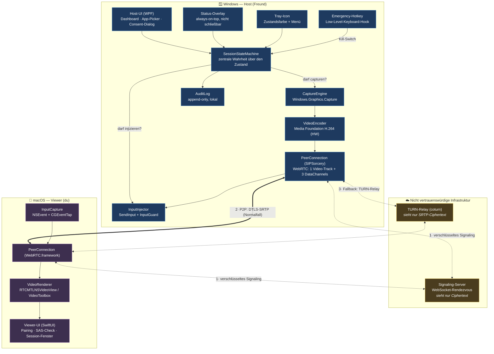
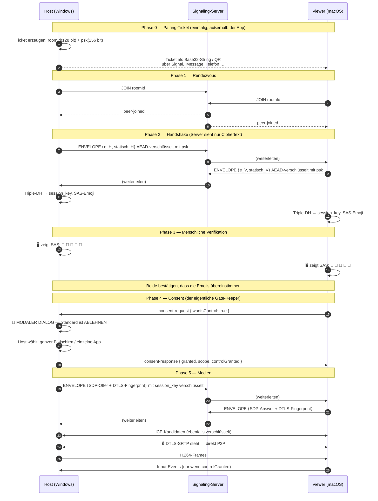
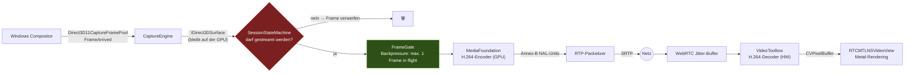
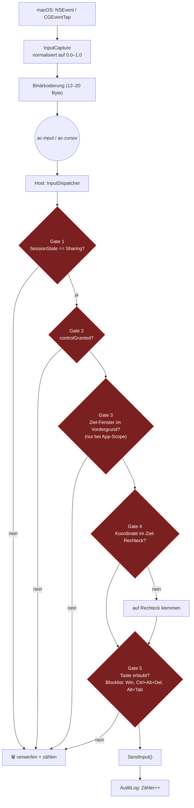
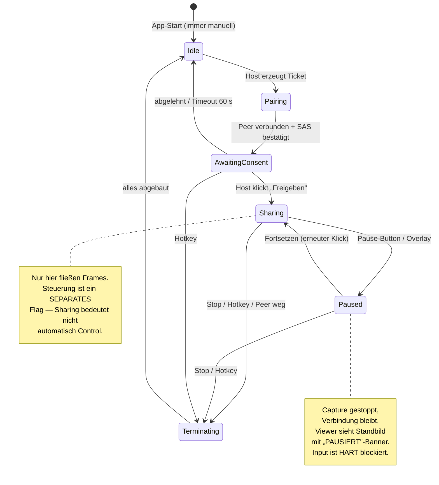

# 1 — Architekturüberblick

> AppControl ist ein Zwei-Parteien-Remote-Control-Tool: **Host** (Windows, teilt Bildschirm oder
> eine einzelne App) und **Viewer** (macOS, sieht zu und darf — nach expliziter Freigabe — Maus und
> Tastatur steuern). Es ist bewusst *kein* Mehrbenutzer-, kein Unattended- und kein
> Enterprise-Fernwartungsprodukt. Diese Beschränkung ist eine Sicherheitsentscheidung, keine Lücke.

---

## 1.1 Leitplanken der Architektur

Vier Eigenschaften bestimmen jede Designentscheidung in diesem Projekt, in dieser Reihenfolge:

| # | Leitplanke | Konsequenz |
|---|---|---|
| 1 | **Der Host behält die Kontrolle** | Kein Frame verlässt den Rechner, bevor der Host zugestimmt hat. Kein Input wird injiziert, bevor der Host Steuerung *separat* freigegeben hat. Stoppen ist immer ein Klick / ein Hotkey. |
| 2 | **Nichts passiert unsichtbar** | Es gibt keinen Stealth-Modus, keinen Headless-Betrieb, keinen Autostart. Die App verweigert den Start ohne sichtbare UI. Ein Overlay zeigt permanent den Zustand. |
| 3 | **Der Server ist nicht vertrauenswürdig** | Signaling- und TURN-Server sehen nur Ciphertext. Die Ende-zu-Ende-Schlüssel entstehen ausschließlich zwischen Host und Viewer. |
| 4 | **Latenz vor Bildqualität** | Bei Konflikt gewinnt die Reaktionszeit: kleinere Auflösung, mehr Kompression, verworfene Frames — aber niemals eine wachsende Warteschlange. |

---

## 1.2 Komponenten in der Vogelperspektive



**Zu lesen ist das so:** Die einzige Komponente, die auf dem Host entscheidet, ob etwas passiert,
ist die `SessionStateMachine`. `CaptureEngine` und `InputInjector` fragen sie bei *jedem* Frame und
*jedem* Event. Es gibt keinen Pfad, der an ihr vorbeiführt — auch nicht über das Netzwerk.

---

## 1.3 Die drei Kanäle

WebRTC gibt uns einen Medien-Track und beliebig viele DataChannels über *eine* ausgehandelte
DTLS-Verbindung. Wir nutzen vier logische Kanäle mit bewusst unterschiedlichen
Zuverlässigkeitsgarantien:

| Kanal | Typ | Zuverlässigkeit | Inhalt |
|---|---|---|---|
| `video` | RTP/SRTP Media-Track | lossy, congestion-controlled | H.264-Stream des freigegebenen Inhalts |
| `ac-control` | DataChannel | **reliable, ordered** | Consent, Share-State, Control-State, Stats, Bye |
| `ac-input` | DataChannel | **reliable, ordered** | Tastendrücke, Mausklicks, Scroll — alles, wo ein verlorenes Event einen kaputten Zustand hinterlässt (z. B. "Taste gedrückt" ohne "losgelassen") |
| `ac-cursor` | DataChannel | **unreliable** (`maxRetransmits: 0`) | reine Mausbewegungen — das jüngste Event macht jedes ältere ohnehin irrelevant |

Die Trennung von `ac-input` und `ac-cursor` ist der wichtigste Latenz-Trick des Protokolls: Bei
Paketverlust blockiert ein Retransmit auf einem reliable-ordered Channel *alle* nachfolgenden
Nachrichten (Head-of-Line-Blocking). Mausbewegungen sind mit Abstand die häufigsten Events —
sie über einen unreliablen Kanal zu schicken hält den kritischen Pfad frei.

---

## 1.4 Datenfluss: Verbindungsaufbau



Der entscheidende Punkt in Phase 5: Der **DTLS-Fingerprint reist innerhalb des mit `session_key`
verschlüsselten Envelopes**. Ein bösartiger Signaling-Server kann ihn nicht durch seinen eigenen
ersetzen, ohne den Schlüssel zu kennen — damit ist ein Man-in-the-Middle auf der Medienstrecke
ausgeschlossen, obwohl der Server jedes Byte durchreicht.

---

## 1.5 Datenfluss: laufender Frame



Zwei Dinge sind hier absichtlich so gebaut:

**Das Gate sitzt vor dem Encoder, nicht vor dem Netzwerk.** Wenn der Host pausiert, wird das Frame
verworfen, *bevor* CPU/GPU-Zeit in die Kompression fließt. Ein pausierter Host kostet praktisch
nichts — und, wichtiger: Es gibt keinen Puffer, in dem noch alte Frames liegen könnten, die nach
dem Pausieren rausgehen.

**Backpressure statt Queue.** Der `FrameGate` lässt maximal ein Frame gleichzeitig im Encoder sein.
Ist der Encoder noch beschäftigt, wenn das nächste Frame kommt, wird das *neue* Frame verworfen —
nicht eingereiht. Eine Queue würde bei Überlast wachsen und die Latenz mit jeder Sekunde
verschlechtern; Verwerfen hält sie konstant. Das ist der Unterschied zwischen "ruckelt bei Last"
und "ist nach zwei Minuten unbenutzbar".

---

## 1.6 Datenfluss: Input (der sicherheitskritische Pfad)



Fünf Gates, alle auf dem Host, alle mit **Deny-by-default**. Der Viewer kann keines davon
beeinflussen — er kann nur Events schicken und hoffen. Details und Begründung jedes Gates in
[`03-consent-and-transparency.md`](03-consent-and-transparency.md).

Besonders wichtig ist **Gate 3**: Bei App-Freigabe wird geprüft, ob das freigegebene Fenster gerade
im Vordergrund ist. Wechselt der Host selbst die Anwendung (etwa um ein Passwort einzugeben),
laufen injizierte Events sofort ins Leere. Ohne dieses Gate wäre "ich teile nur Notepad" eine
Illusion — der Viewer könnte mit Mauskoordinaten außerhalb des Fensters in jede beliebige
Anwendung klicken.

---

## 1.7 Zustandsmaschine des Hosts

Alles, was sichtbar ist, und alles, was erlaubt ist, leitet sich aus genau einem Enum ab:



`Sharing` und `controlGranted` sind absichtlich orthogonal. Der häufigste Fall ist "ich zeige dir
was, fass nichts an" — der muss der einfachste sein, und er ist der Standard.

---

## 1.8 Verzeichnisstruktur

```
AppControl/
├── docs/                       # Diese Dokumentation (7 Kapitel)
├── protocol/                   # Sprachneutrale Protokollspezifikation
│   └── schemas/                # JSON-Schemas der Control-Nachrichten
├── signaling/                  # Node/TypeScript Rendezvous-Server  ← läuft & getestet
├── tools/crypto-vectors/       # Referenz-Testvektoren für den Handshake
├── host-windows/               # .NET 8 / WPF Host-Anwendung
│   └── src/AppControl.Host/
│       ├── Core/               # SessionStateMachine — die zentrale Wahrheit
│       ├── Capture/            # Windows.Graphics.Capture + Fensterauswahl
│       ├── Encoding/           # Media Foundation H.264
│       ├── Input/              # SendInput, InputGuard, Emergency-Hotkey
│       ├── Net/                # Signaling-Client, WebRTC-Peer
│       ├── Security/           # Identität, Handshake, Trust-Store, SAS
│       ├── Ui/                 # Dashboard, App-Picker, Consent, Overlay, Tray
│       ├── Audit/              # Append-only Protokoll
│       └── Config/             # Einstellungen
└── viewer-macos/               # Swift 5.9 / SwiftUI Viewer-Anwendung
    └── Sources/AppControlViewer/
        ├── App/, UI/           # SwiftUI-Oberfläche
        ├── Net/                # Signaling, WebRTC
        ├── Security/           # Spiegelbild der Host-Krypto
        ├── Video/              # Metal-Rendering
        ├── Input/              # NSEvent/CGEventTap → Binärprotokoll
        └── Protocol/           # Nachrichtentypen
```

---

## 1.9 Was bewusst *nicht* gebaut ist

| Nicht enthalten | Grund |
|---|---|
| Unattended Access / Autostart | Widerspricht Leitplanke 1 und 2. Ein Tool, das ohne Anwesenden startet, ist ein RAT. |
| Mehrere gleichzeitige Viewer | Vergrößert die Angriffsfläche des Consent-Modells erheblich für einen Anwendungsfall, den es hier nicht gibt. |
| Dateiübertragung | Eigenständiger Vertrauens- und Malware-Vektor; gehört nicht in denselben Kanal wie Screen-Sharing. |
| Audio | Kein Teil der Anforderung. Der Medienpfad ist so gebaut, dass ein zweiter Track später ohne Umbau dazukommt. |
| Stealth-/Minimiert-Modus | Explizit ausgeschlossen. Siehe [`03-consent-and-transparency.md`, §3.9](03-consent-and-transparency.md). |
